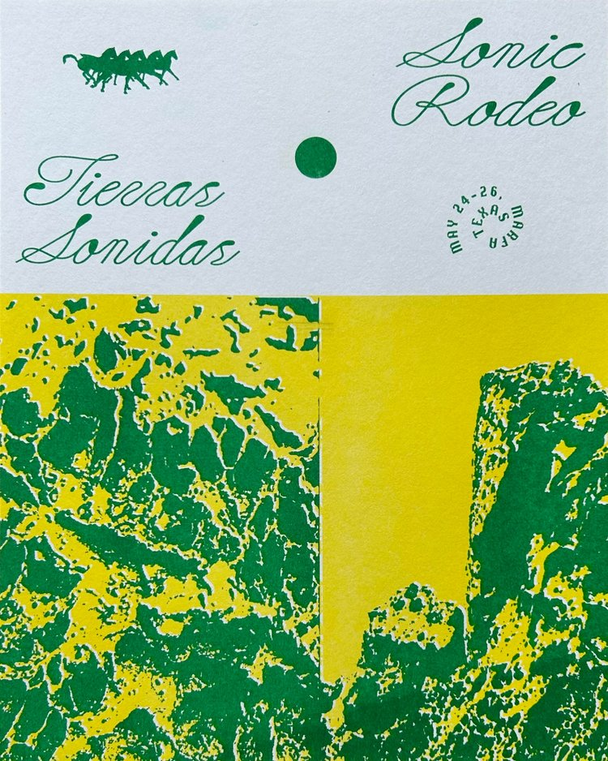

+++
title = 'Work'
date = 2024-09-10T13:19:40-05:00
draft = true
+++

# Upcoming

None at the mooment.

# Recent

## Chimera

#### July 18, 2024
### Pease Park, Austin, TX

In celebration of World Listening Day, July 18th, 2024 at 7pm, Collide Arts and Phonography Austin presented a sound installation, CHIMERA, in which field recordings were be played continuously throughout lower Pease Park. Artists were encouraged to submit field recordings that were made outside of the context of Pease Park – other biomes than Pease Park, from other seasons than summer, in other contexts than an urban park, in order to find out what happens when one soundscape is grafted onto another

Other contributing artists are Ann Armstrong, Henna Chou, Ara Herandez, Alex Keller, Steven N. Landry, Christopher McConnell, H. Montgomery, Alex Keller, and Josh Ronsen.

Link to detail specific page, other main page of the site, gallery, more assets, etc
https://worldlisteningday.org/events/chimera-world-listening-day-2024/

&nbsp;

## 

## Tierras Sónidas

<!-- {{ $image := resources.Get "/images/eva-poster-cropped.jpg" }}
{{ $resized := $image.Resize "600x" }}
 -->

<!-- {{ with .Resources.Get "/eva-poster-cropped.jpg" }}
  
{{ end }} -->

Date: May 25, 2024
Location: Other Side Speakeasy, Marfa, TX

Photos: Rowdy’s performance shots

2-3 sentence paragraph or 2
In "Hindsight", Adam Hilton, Henna Chou and Laura Brackney sonically confronted the accumulation of memory as we age, and how our natural tendencies to look to our past for meaning only become more of a barrier to the present the older we get.

Tierras Sonidas Sonic Rodeo is a sound art festival that blossomed from desert visions during the opening performance of 'Not Flowers', a solo visual exhibition by Mo Eldridge at Do Right Hall in 2023. The event witnessed a convergence of sonic energy from Super Ethereal Champion World, Anthony Desimone, Veronica Anne Salinas, Liv Mershon, Eric Capper, and Mo Eldridge, each performing around a communal table to a packed audience. 

That energy was carried forward in this year’s Sonic Rodeo, bringing together emerging and established performers and artists from Texas, the Midwest, Oklahoma, and California. Set in the Marfa community, Tierras Sonidas celebrated sound art and experimental sounds inspired by the West Texas landscape.

Credits
Festival Directors: 
- Veronica Anne Salinas
- Liv Mershon
- Eric Capper
- Mo Eldridge
- Andrew Stevens

Other artists
- A Molten Plains Ensemble
- Air Field
- Andrew Stevens
- Anne F-Jacques
- Andrew Weathers/Ryan Seward/Kory Reeder
- Corey Fogel
- Dirtee Clouds
- Eric Capper
- Kim Upstill
- Liv Mershon
- Megan Jeanne Gette
- Mo Eldridge
- Nick Hurt
- Spirit Plate
- Tara Bhattacharya a.k.a. Subaltern Tongue
- Heloise Gold
- Tom Carter/Rachel Orosco
- Weathering
- Virginia L Montgomery (VLM)
- Will Floyd

Link to detail specific page, other main page of the site, gallery, more assets, etc
Gallery Page (create in CMS)
TS site: https://www.sonicrodeo.org/

## Forest Meditation

In association with Elizabeth Chapin’s Treespell
Date: February 9, 2024
Location: Women and Their Work Gallery

2-3 sentence paragraph or 2
Hilton and Chou respond to Elizabeth Chapin’s Treespell exhibit, using electronic and acoustic sounds to engage the audience in a meditative environment.

About Treepsell: A commentary on today’s crowded visual culture and the growing sense of separation between humans and nature, Chapin’s work reflects and rejects the ways in which the modern world has turned away from nature and toward a constant influx of digital visual information. Treespell is an overarching story about this mutual spell that we’re all involved in; we become ‘beasted’ when we become separate from nature. Chapin’s colorful paintings of trees, which she approaches with the specific and thoughtful care usually reserved for portraiture, remind us of the value of returning our time, attention, and gaze back toward the natural world.

Create Image gallery in CMS
Forest Meditation: https://womenandtheirwork.org/archive/forest-meditation/
Treespell: https://womenandtheirwork.org/archive/elizabeth-chapin/

## Pre-Heat Festival

Sept XX, 2023

Gentle our Driftless Caravan
September 1-2 & 8-12, 2022
Rain Lily Farm | Austin, TX

Gentle our Driftless Caravan was a reverie contemplating bereavement, lassitude, and water— untenable to the experience— with its dichotomies as essence of life and a prevailing force of nature. Performed by dancers Alexa Capareda, Siri Cyan, Taryn Lavery, Clay Moore and Oddalys Salcido, with a live score by Henna Chou and Adam Hilton, set design by Ia Ensterä and lighting design by Natalie George Productions.

Choreographic Direction: Alexa Capareda, Taryn Lavery, Alex Miller
Dance Collaboration & Performance: Alexa Capareda, Siri Cyan, Taryn Lavery, Clay Moore, Oddalys Salcido
Set Design: Ia Ensterä
Lighting Design: Natalie George Productions
Costumes: Alexa Capareda, Taryn Lavery (additional fabrication), Alex Miller
Executive Production: En Route Productions

Link to detail specific page, other main page of the site, gallery, more assets, etc
XXXXX

“The score and choreography combine to suggest big emotions— separation, grief, love— and the farm setting roots the piece in a deep sense of place. It is spectacular and meditative, intimate and grand— triumphantly full of contradictions that work.”
- Courtney Thomas, SIGHTLINES Magazine

## Collide / WFC
2021 - 2023

## Photography Annual Report
2021

# Past

## Musical Projects

### Aardvark
Abstract / Ambient
Aardvark was a duo project between Adam Hilton and Travis Ray Austin. Special guest Mari Rubio joined them for a performance in the 2019 NMASS Festival

Album recordings

### Linen Closet, band leader

Linen Closet was an indie-folk band that leaned heavily into orchestral and electronic elements. Performances would just as often include quiet, poignant songs with 10-piece string & wind ensembles as they would driving, Afro-pop inspired drum machine rhythms. 

Listen if you like Akron/Family, Sufjan Stevens, the National, Grizzly Bear, Bon Iver.



Notable performances & press
- Soundspace at the Blanton
- Central Presbyterian Church
- KUTX’s song of the day
- Austin Monthly feature
- Pop press intl features?
- Other press

Members & guest players included
- Mari Rubio
- Steven Smith
- Sara Berger
- Lauren McMurray
- Andrew Stevens
- Dustin Withers
- Aaron Castillo
- Jessica Eley
- Matthew Grusha
- Travis Ray Austin
- Ethan Frederick Greene
- Henna Chou

## Recording & mix engineer
- Jad Fair 
- Graham Weber

## Location Sound Mixer & Mastering Engineer
- Hardly Sound, Austin’s PBS
- Jandek “Kooken”, a one-act play

## Accrue Cassettes, label owner
2012 - 2016
Featured Texas indie-rock artists
Tribute Compilations for artists Jason Molina and David Bowie, all proceeds donated to relevant organizations & funds

## Sound design & recording for video games
* hornet smash
* Cell

## Sound engineer, sound designer, composer for theatre
- Fusebox Festival
- Mary Moody Northen Theatre at St. Edward’s University
- ZACH Children’s
- Breaking String Theatre
- HBMG Foundation
- Cambiare productions
- GNAP
- Capital T Theatre